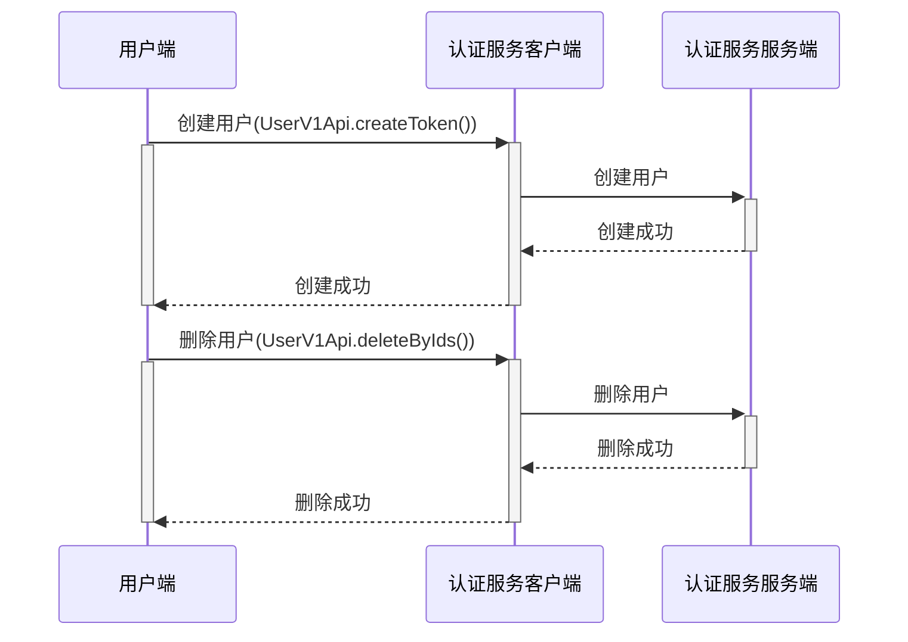

# CLIENT

客户端SDK，使用最小依赖开发(用户需要某个功能，自己要在项目中引入某些依赖)
> 项目打包时，不会将三方jar依赖一起打包进来。只要不使用到三方jar的类，就不会报错。如果使用过程中，有需要使用三方类，就需要自己引入相关依赖。
## 功能
+ 常用接口调用编写(注意使用签名)

### 常用接口调用编写

## 基本需求
1. jdk 1.8
2. 基础依赖：
```xml
<dependencies>
    <!--【基础依赖】-->
    <dependency>
        <groupId>org.slf4j</groupId>
        <artifactId>slf4j-api</artifactId>
    </dependency>
    <dependency>
        <groupId>ch.qos.logback</groupId>
        <artifactId>logback-classic</artifactId>
    </dependency>
    <dependency>
        <groupId>org.projectlombok</groupId>
        <artifactId>lombok</artifactId>
        <scope>provided</scope>
    </dependency>
    <dependency>
        <groupId>org.junit.jupiter</groupId>
        <artifactId>junit-jupiter</artifactId>
        <scope>test</scope>
    </dependency>
    <!--【必须】-->
    <dependency>
        <groupId>com.squareup.okhttp3</groupId>
        <artifactId>okhttp</artifactId>
        <exclusions>
            <exclusion>
                <groupId>com.google.android</groupId>
                <artifactId>android</artifactId>
            </exclusion>
        </exclusions>
    </dependency>
    <dependency>
        <groupId>com.fasterxml.jackson.core</groupId>
        <artifactId>jackson-databind</artifactId>
    </dependency>

    <!-- 【可选依赖】 -->
    <!--redis-->
    <dependency>
        <groupId>org.springframework.data</groupId>
        <artifactId>spring-data-redis</artifactId>
    </dependency>
    <!--JWT-->
    <dependency>
        <groupId>io.jsonwebtoken</groupId>
        <artifactId>jjwt</artifactId>
    </dependency>
</dependencies>
```


## Quick Start
将本应用打包后引用到spring项目中去。
```xml
<dependencies>
    <!--【必须依赖】-->
    <dependency>
        <groupId>org.slf4j</groupId>
        <artifactId>slf4j-api</artifactId>
    </dependency>
    <dependency>
        <groupId>com.goudong</groupId>
        <artifactId>client</artifactId>
        <scope>system</scope>
        <version>1.0</version>
        <systemPath>${pom.basedir}/lib/client.jar</systemPath>
    </dependency>
    <dependency>
        <groupId>com.squareup.okhttp3</groupId>
        <artifactId>okhttp</artifactId>
        <exclusions>
            <exclusion>
                <groupId>com.google.android</groupId>
                <artifactId>android</artifactId>
            </exclusion>
        </exclusions>
    </dependency>
    <dependency>
        <groupId>com.fasterxml.jackson.core</groupId>
        <artifactId>jackson-databind</artifactId>
    </dependency>

    <!-- 【可选依赖】 -->
    <!--redis-->
    <dependency>
        <groupId>org.springframework.data</groupId>
        <artifactId>spring-data-redis</artifactId>
    </dependency>
    <!--JWT-->
    <dependency>
        <groupId>io.jsonwebtoken</groupId>
        <artifactId>jjwt</artifactId>
    </dependency>
</dependencies>
```
必须依赖：需要该项目频繁使用了它们的API，所以三方应用必须引入才能正常使用工具。
可选依赖：在用户使用一些具体功能或模块时，必须引入对应的依赖。

### 使用
在使用之前，需要进行客户端应用的初始化：
```java
import com.goudong.authentication.client.util.GoudongAuthenticationClient;

public class Demo {
    public static void main(String[] args) {
        // 服务端请求地址
        String serverUrl = "http://127.0.0.1:8080/api/authentication-server";
        // 应用ID
        Long appId = 1754050005607776256L;
        // 应用密钥
        String appSecret = "4e633fb3e418405f9e0d0ca275b3ef35";
        // 应用证书序列号
        String serialNumber = "25ce864c76352d63";
        // 应用证书私钥
        String privateKeyStr = "MIIEvQIBADANBgkqhkiG9w0BAQEFAASCBKcwggSjAgEAAoIBAQCbDgofseAhY2DT9FBZgtIdleWlD35RzdZvBOZVb9S9RTCAHyZVwA1t9tGwENH7VEBZ4qYrohcetAPf32+GHTtLv3EgwYkyYlDeQkPcdyOFoxK5NvnLARL8h4yL4USco9sDzzj6msEvYyxm3x0vD2XHzIZ0fFb5mM38ub9agsiv/GlPUjDqJ0RLDVwKH4IVz1a1G1Fqcvr97dah94jYX/l5GDHNsb/P6Pe942D+anm63wVuYMKNdqUXRepxRWpszj3nepE03CQZVrGjTcpozSZorWwI+bZv9K2u38D+eRbxGOVkGINY+kdKli3RZ3GlkgN+qGmpsSTJyHfQX2CrApmbAgMBAAECggEAFUxGY7ghGzT1VefXKZRonBu84YFRTpdBfxpjMRUdWaopUU/2Cg1JSvN+Nfr5fNZDyJTzUkb/ef4sEhI01W0qeesf9OngmIUcqorbm2rZ/D88ESjWAuZw3zMXQRd+Py3apZlPME0VgBbVQIQhFBe/WURkq5dwsvQkRzSUbjBMtK91W+RCVu5Ux3UW/Oj0SabJWoJKjNEkgODrvMtzA/iiNKiUg52aTYbhy0QaLld8a+oLxqv0+//D9Ctt4yRj0XsXxRzgJ+9twh+6NCCYOm0iyJZTOcXNF9yLnGFthyOYk48f0ueUV4VJa6lkQ3+oCqhVcXKhg5aeABXS3vm7MWRNMQKBgQDx2TNSrQwFXNtdSPexYQc9gzKAb1yUG9OSYFRX76NMy10Wdt7eewr33t8nDFUgYwDCRZys2Qrng++9zXJG9jpr5g2KerH/JHBAaLNJ0ngr7NC6Jf9iQVkhtE+Dmikw2dPzH3sbqnupsjUmpqSUmagwHeN9Kg48ZXD64RtZphYr5QKBgQCkILQMRk0icQOvaYLIf69/0dsFrG+3iHtkzDYNCWTaQbNWmUB7qVoCUAhWUHNX/sllxsaY3NarUfJMTcNbQzE33XY0QxPbisihPJJNUA0Nbnby1ibIDG9tAwIqYQnHSbohBPzAQ3bL+rHofERiPeWdLl/w7b67YgPLvgz3ZzhXfwKBgQCkfkWxIu/9KcYuMbX+2G7TQMv1nUjLmA2UDp7vXJemYN+Eqv81NV0lcFo5NeMkbxISEMTar5kCFLPYVcc3Srw7rTJikMdGMWOD+3KOcG+5+I2TPsrv6mCUUw6OBSmlB1Nolm3mSFNp/UK3cjqYs9Y4O+wBsrwSCjEJAljW5edInQKBgFhyOzSmKekWiAreTBkqHfQ+rc3359g612wxVCtgVZX8c92GBqbdU2ENqgCBqDbSWcvb+6fi0lhOd8lA2rbylbJqSMnPIANeXdHt51V8fxwu3DDu0MVbViyjw2X9FxzrET+8BUzCzmEL/xWu6dcbTgKPPCqEpBUss6j3CNvGJymXAoGADx+7ZASD6BmWNmpCr1WaFReWbgnXQHDdMU/lleLqecbunWBiN8ZeepYu0tgfZVJi1itaGVpqEmvfYzVGdIJdFGSGo9l+MrzIqEgrP9PzYLY1AOgX8jAEDhzA5LgaIP/CE42sKQK1fyl6jZuRXYyH9k8mltV7AEBb6TbqA6ZFbxc=";
        /*
                调用API初始应用，首次初始的应用为系统默认的应用。当后续使用工具不传递appId参数时，工具会自动获取默认应用进行处理。
        
                在其它地方可以使用API获取到客户端:
                GoudongAuthenticationClient appClient = GoudongAuthenticationClient.getClient(appId);
                
                在其它地方可以使用API获取到默认客户端:
                GoudongAuthenticationClient appClient = GoudongAuthenticationClient.getDefaultClient();
                
                可以执行多应用初始。
                GoudongAuthenticationClient newAppClient = GoudongAuthenticationClient.init(serverUrl, newAppId, newAppSecret, newSerialNumber, newPrivateKeyStr);
                初始化过后
         */
        GoudongAuthenticationClient appClient = GoudongAuthenticationClient.init(serverUrl, appId, appSecret, serialNumber, privateKeyStr);
        
    }
}
```
API介绍：
创建用户：



